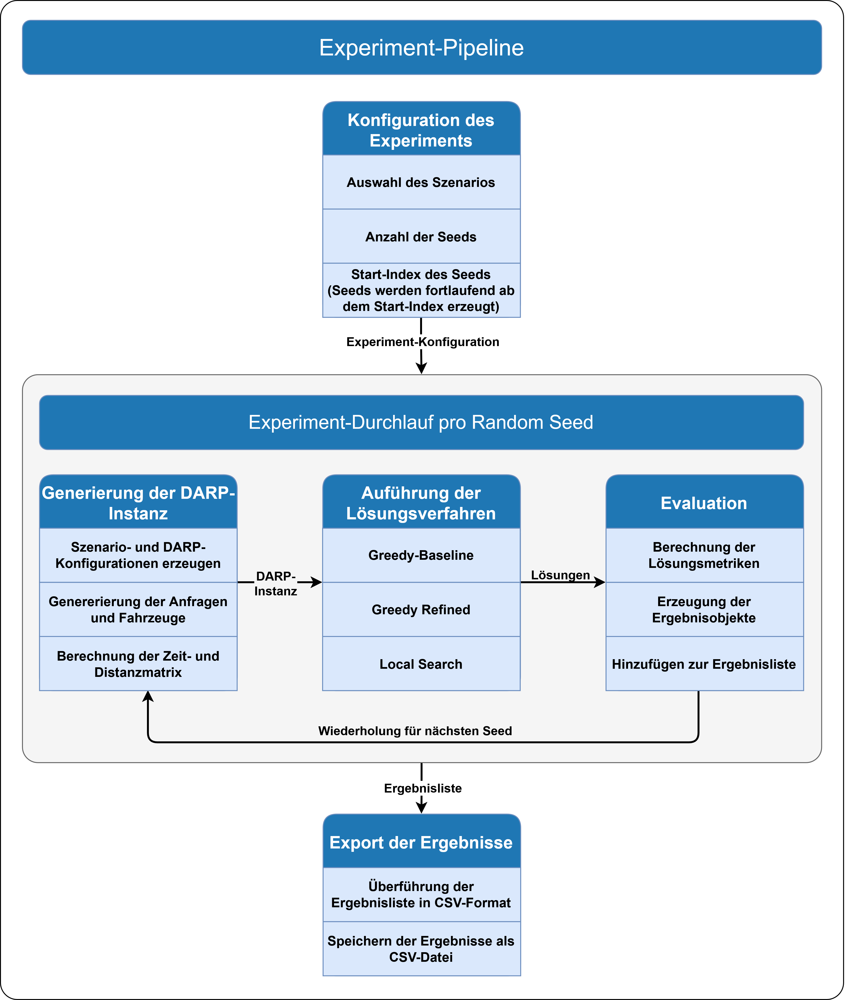

# DARP Algorithms – Implementierung eines Experiment-Systems

## Autor

Christoph Vorer  
Masterarbeit – Universität Münster  
Lehrstuhl für Effiziente Algorithmen und Algorithm Engineering

---

## Projektbeschreibung

Dieses Projekt implementiert im Rahmen meiner Masterarbeit zum Thema  
*"Meta-heuristische Verfahren zur Lösung von Varianten des Dial-a-Ride-Problems für Ridepooling-Dienste"*  
ein modulares und hoch konfigurierbares Experiment-System zur Evaluation von Lösungsverfahren für das
Dial-a-Ride-Problem (DARP).

---

## Inhalt des Projekts

- Modellierung des Dial-a-Ride-Problems
- Modulares Experiment-System zur Evaluation von Lösungsverfahren des DARPs
- Generierung synthetischer Szenarien
- Auswertung anhand ausgewählter Evaluationsmetriken

---

## Implementierte Verfahren und Szenarien

### Lösungsverfahren

- `Greedy Baseline`
- `Greedy Refined`
- `Local Search`

### Szenarien

- `basic`
- `time_restrictive`
- `resource_restrictive`

---

## Experiment-Design

Experimente werden über vier zentrale Konfigurationsklassen gesteuert:

- `ScenarioConfig`
- `DarpConfig`
- `ConstraintConfig`
- `ObjectiveConfig`

### ScenarioConfig

Definiert die Parameter des Szenarios, z. B.:

- Anzahl der Anfragen
- Anzahl der Fahrzeuge
- Zeitrahmen des Szenarios
- Passagierverteilungen

### DarpConfig

Legt die Rahmenbedingungen des DARPs fest:

- Zielfunktion (`ObjectiveConfig`)
- Nebenbedingungen (`ConstraintConfig`)
- Fahrzeugkapazitäten

---

## Experiment-Pipeline

  

  <em>Übersicht über den Ablauf der Experiment-Pipeline.</em>

Die Datei `index.py` enthält die vollständige Durchführung der Experimente.

### Ablauf

1. **Auswahl der Experiment-Parameter (Konsole)**
    - Szenario (`basic`, `time_restrictive`, `resource_restrictive`)
    - Anzahl der Seeds (Experiment-Durchläufe)
    - Start-Seed (nachfolgende Seeds werden inkrementell erzeugt)

2. **Generierung der DARP-Instanz**
    - Erzeugung von Anfragen und Fahrzeugen
    - Aufbau einer `DarpInstance` inklusive Distanz- und Zeitmatrix
    - Bei nicht routbaren Instanzen: automatischer Retry mit angepasstem Seed

3. **Ausführung der Lösungsverfahren**
    - `Greedy Baseline`
    - `Greedy Refined`
    - `Local Search`

4. **Evaluation der Lösungen**
    - Berechnung von Metriken (z. B. Fahrzeit, Kosten)
    - Strukturierte Speicherung der Ergebnisse

5. **Ausgabe und Speicherung**
    - Konsolenausgabe der Ergebnisse
    - Speicherung in:  
      `artifacts/evaluation_results.csv`

---

## Ziel der Pipeline

Die Pipeline ermöglicht:

- reproduzierbare Experimente durch seedbasierte Instanzgenerierung
- systematischen Vergleich der Lösungsverfahren
- Analyse der Auswirkungen unterschiedlicher Szenarien und Konfigurationen